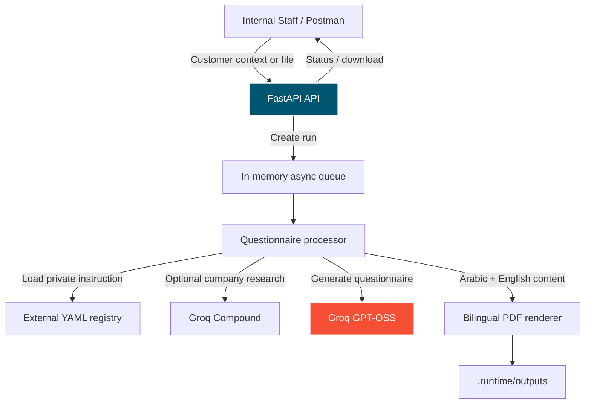

# Datum Engine

[](https://fastapi.tiangolo.com/)
[](https://www.python.org/)
[](https://groq.com/)

**Datum Engine** is OdooTec's internal asynchronous AI document-execution service. Odoo owns engagements, source revisions, approvals, document versions, findings, and review cycles; FastAPI executes versioned skills and returns validated document/review outputs.

This version runs locally: FastAPI keeps a small local queue and JSON run records, while Odoo remains the internal user interface and document system of record. No PostgreSQL, Redis, Docker, or separate worker service is required.

---

## System Architecture



---

## Local execution pipeline

1. **Accept** — Odoo submits a skill identifier/version, immutable source revisions, and parameters. FastAPI immediately returns `202 Accepted` with a run ID.
2. **Queue** — local asynchronous workers process the run while Odoo polls its status.
3. **Generate** — the selected external skill instruction and the registered source material are sent to Groq when configured; a detailed fallback supports offline testing.
4. **Render** — FastAPI creates a Word document and a browser preview, then Odoo imports the finished files.

---

## Current features

### Discovery Questionnaire

- Arabic and English questionnaire generation.
- Customer name, website, industry, country, and staff notes as input.
- File-text extraction for PDF, DOCX, TXT, and Markdown attachments.
- Optional company web research.
- Groq GPT-OSS generation.
- Groq Compound web research.
- Asynchronous local processing with run status polling.
- Idempotency protection.
- Downloadable PDF output.
- Safe error responses that do not expose prompts, instructions, or API keys.

## Project Structure

```text
datum-engine/
├── .env                       # Local secrets; never commit this file
├── .env.example               # Safe configuration template
├── requirements.txt
├── README.md
├── src/
│   ├── main.py                # FastAPI application and worker lifecycle
│   ├── api/
│   │   └── router.py          # Versioned /api/v1 routing
│   ├── core/
│   │   ├── config.py          # Typed environment settings
│   │   ├── logging.py         # Safe structured logging
│   │   ├── exceptions.py      # Domain exceptions
│   │   └── error_handlers.py  # Safe HTTP error responses
│   ├── discovery_questionnaire/
│   │   ├── controller.py      # Questionnaire endpoints
│   │   ├── dependencies.py    # Feature dependency wiring
│   │   ├── repositories/      # Temporary in-memory run storage
│   │   ├── schemas/           # Pydantic request, response, and YAML schemas
│   │   └── services/          # Run service, registry, and processor
│   ├── shared/
│   │   ├── document_processing/ # PDF/DOCX/TXT extraction
│   │   ├── llm/               # Groq generation interface
│   │   ├── queue/             # Local async queue
│   │   ├── rendering/         # Bilingual PDF renderer
│   │   └── web_research/      # Groq Compound research
│   └── clarification/                   # Future feature skeleton
└── tests/
    └── discovery_questionnaire/
```

---

## Local Setup

### 1. Prerequisites

- Python 3.12 or newer.
- A Groq API key for questionnaire generation and optional web research.

### 2. Install dependencies

```powershell
pip install -r requirements.txt
```

### 3. Configure environment variables

Copy `.env.example` to `.env`, then configure it. Keep real secrets only in `.env`.

```env
REGISTRY_PATH=C:\tmp\datum-engine-registry

GROQ_API_KEY=your_groq_key
GROQ_MODEL=openai/gpt-oss-20b
GROQ_RESEARCH_MODEL=groq/compound
DEV_OUTPUT_DIR=./.runtime/outputs
```

`REGISTRY_PATH` must be an absolute path outside this repository. It contains a private, versioned skill definition. The deployed `deployment/registry` files are examples only; their placeholder instructions are deliberately rejected.

```yaml
identifier: gen-discovery-questions
version: "0.1-demo"
kind: generator
accepted_source_material:
  - type: prospect_context
    required: true
  - type: attachment
    required: false
outputs:
  - document_type: discovery_questionnaire
    distribution_class: client_permitted
instruction: Create an evidence-based Arabic and English discovery questionnaire.
```

### 4. Run the API

```powershell
uvicorn src.main:app --reload
```

Swagger UI is available at [http://127.0.0.1:8000/docs](http://127.0.0.1:8000/docs).

---

## API Usage

Base URL:

```text
http://127.0.0.1:8000/api/v1
```

### Check questionnaire configuration

```text
GET /discovery-questionnaire/configuration/gen-discovery-questions
```

The response includes only safe metadata. The private `instruction` is excluded.

### Extract an attachment

```text
POST /discovery-questionnaire/source-files/extract
```

Use `form-data` in Postman with a `file` field. Copy the returned object into `source_material` when creating a run.

### Create a questionnaire run

```text
POST /discovery-questionnaire/runs
```

```json
{
  "questionnaire_identifier": "gen-discovery-questions",
  "idempotency_key": "postman-test-001",
  "customer": {
    "name": "Example Company",
    "website": "https://example.com",
    "industry": "Construction",
    "country": "Egypt",
    "notes": "The company is considering a digital transformation project."
  },
  "source_material": [
    {
      "source_id": "staff-context-001",
      "type": "prospect_context",
      "origin": "staff_provided",
      "text": "The customer needs a system for projects, sales, accounting, procurement, and reporting."
    }
  ],
  "options": {
    "languages": ["ar", "en"],
    "web_research_enabled": false
  }
}
```

The API returns `202 Accepted` and a `questionnaire_run_id` immediately.

### Poll status and download the PDF

```text
GET /discovery-questionnaire/runs/{questionnaire_run_id}
GET /discovery-questionnaire/runs/{questionnaire_run_id}/output
```

Wait until the state is `succeeded`, then use **Send and Download** in Postman for the output request.

---

## Tests

Run the test suite:

```powershell
python -m pytest tests -q
```

The test suite covers configuration safety, idempotency, run state, provider fallback, text extraction, and bilingual PDF generation without calling cloud providers.

---

## Development Notes

- Local mode is for development only; it has no durable job queue or database.
- The current setup is local-only: FastAPI and Odoo run on the same internal machine or network, with local background workers and JSON run-state files.
- Generated output requires retention and backup management through the deployment volume or production object store.

---

## Foundation Architecture (Odoo 17)

The production workflow is owned by the Odoo 17 `datum_engine` module. It stores
engagements, immutable source artefact revisions, document versions, review cycles,
findings, question sets, approvals, and AI run metadata. The FastAPI service performs
only asynchronous AI execution and document rendering.

The generic service endpoint is `POST /api/v1/runs`. Odoo supplies a skill
identifier/version, source material revisions, and run parameters; it receives a run
identifier immediately and polls its status. No request, response, log, or Odoo record
contains a prompt or instruction.

The placeholder registry is external to this repository. For this installation it is
at `C:\ProgramData\OdooTec\datum-engine-registry` and contains the four configured
demo entries: `gen-discovery-questions`, `gen-strs`, `gen-sow`, and `rev-sow`.

Install the Odoo module from `odoo_addons/datum_engine` into Odoo's configured
`custom_addons` directory, install it in Apps, then set the system parameter
`datum_engine.service_url` to the running FastAPI service URL. The Odoo polling cron
runs every minute.

### Assumptions

- Odoo administrators are the only users during this phase.
- Every output requires a human approval before it can be cleared.
- Authentication is intentionally deferred for the local demo phase.

### Open questions

- Confirm the final OdooTec Word templates and document metadata requirements.
- Confirm the production queue and database platform before deployment.
- Confirm the operational role responsible for changing the external skill registry.
- Do not commit `.env`, model keys, generated PDFs, or the external YAML registry.
