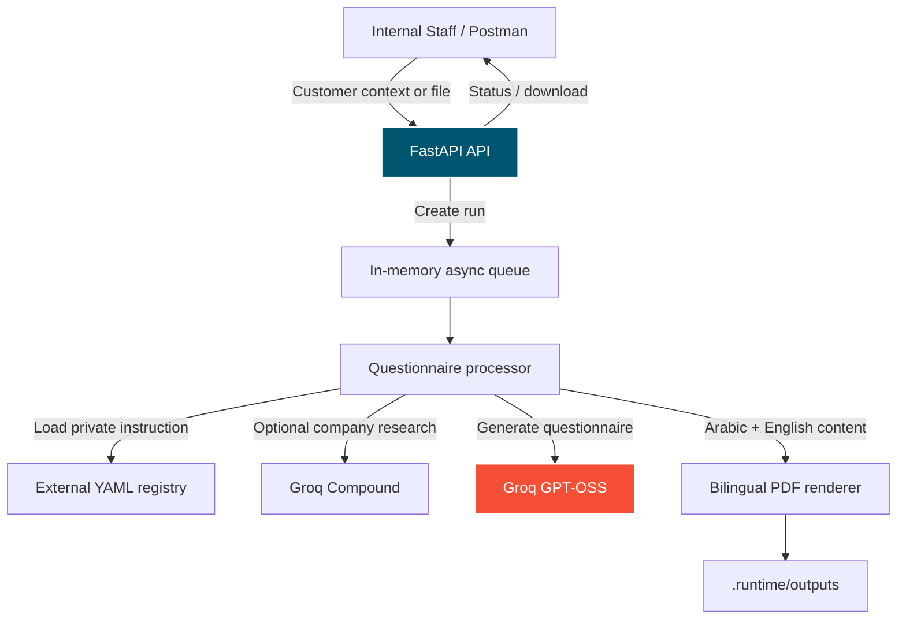

# Datum Engine

[](https://fastapi.tiangolo.com/)
[](https://www.python.org/)
[](https://groq.com/)

**Datum Engine** is an internal FastAPI service that generates bilingual discovery-questionnaire PDFs for OdooTec projects. It accepts staff-provided customer context and uploaded documents, enriches that context with optional public web research, then produces Arabic and English questions through cloud LLM providers.

The service is currently a local development base. It deliberately has no database: temporary run state, background work, and generated files are local until Odoo and Redis integrations are added.

---

## System Architecture



---

## Discovery Questionnaire Pipeline

1. **Extract files** — PDF, DOCX, TXT, and Markdown files are converted to safe text.
2. **Accept a run** — the API validates the JSON request and enforces idempotency.
3. **Queue processing** — the request returns immediately as `queued`; a local worker handles generation in the background.
4. **Load configuration** — the questionnaire identifier resolves to an external YAML configuration. Its private instruction is never returned by the API or logs.
5. **Research the company** — optional public research uses Groq Compound. A research failure does not block the run.
6. **Generate questions** — Groq GPT-OSS generates the questionnaire.
7. **Render the PDF** — Arabic text is shaped for RTL display and English content is kept in the same downloadable document.
8. **Read the result** — runs move through `queued`, `running`, `succeeded`, or `failed`.

---

## Current Features

### Discovery Questionnaire

- Arabic and English questionnaire generation.
- Customer name, website, industry, country, and staff notes as input.
- File-text extraction for PDF, DOCX, TXT, and Markdown attachments.
- Optional company web research.
- Groq GPT-OSS generation.
- Groq Compound web research.
- Asynchronous local processing with run status polling.
- Idempotency protection.
- Downloadable PDF output.
- Safe error responses that do not expose prompts, instructions, or API keys.

### Planned Integrations

- Odoo as the persistent system of record for runs, files, and outputs.
- Redis as the durable background queue.
- API token authentication for Odoo requests.
- Retry policy using `RUN_MAX_ATTEMPTS`.
- Approved OdooTec document templates and structured model output validation.
- Stakeholder requirements, review, scope-of-work, and clarification modules.

---

## Project Structure

```text
datum-engine/
├── .env                       # Local secrets; never commit this file
├── .env.example               # Safe configuration template
├── requirements.txt
├── README.md
├── src/
│   ├── main.py                # FastAPI application and worker lifecycle
│   ├── api/
│   │   └── router.py          # Versioned /api/v1 routing
│   ├── core/
│   │   ├── config.py          # Typed environment settings
│   │   ├── logging.py         # Safe structured logging
│   │   ├── exceptions.py      # Domain exceptions
│   │   └── error_handlers.py  # Safe HTTP error responses
│   ├── discovery_questionnaire/
│   │   ├── controller.py      # Questionnaire endpoints
│   │   ├── dependencies.py    # Feature dependency wiring
│   │   ├── repositories/      # Temporary in-memory run storage
│   │   ├── schemas/           # Pydantic request, response, and YAML schemas
│   │   └── services/          # Run service, registry, and processor
│   ├── shared/
│   │   ├── document_processing/ # PDF/DOCX/TXT extraction
│   │   ├── llm/               # Groq generation interface
│   │   ├── queue/             # Local async queue
│   │   ├── rendering/         # Bilingual PDF renderer
│   │   └── web_research/      # Groq Compound research
│   ├── stakeholder_requirements/        # Future feature skeleton
│   ├── stakeholder_requirements_review/ # Future feature skeleton
│   ├── scope_of_work/                   # Future feature skeleton
│   ├── scope_of_work_review/            # Future feature skeleton
│   └── clarification/                   # Future feature skeleton
└── tests/
    └── discovery_questionnaire/
```

---

## Local Setup

### 1. Prerequisites

- Python 3.12 or newer.
- A Groq API key for questionnaire generation and optional web research.

### 2. Install dependencies

```powershell
pip install -r requirements.txt
```

### 3. Configure environment variables

Copy `.env.example` to `.env`, then configure it. Keep real secrets only in `.env`.

```env
REGISTRY_PATH=C:\tmp\datum-engine-registry

GROQ_API_KEY=your_groq_key
GROQ_MODEL=openai/gpt-oss-20b
GROQ_RESEARCH_MODEL=groq/compound
DEV_OUTPUT_DIR=./.runtime/outputs
```

`REGISTRY_PATH` must be an absolute path outside this repository. It contains the private questionnaire instruction, such as:

```yaml
identifier: gen-discovery-questions
version: "0.1-demo"
kind: generator
accepted_source_material:
  - type: prospect_context
    required: true
  - type: attachment
    required: false
outputs:
  - document_type: discovery_questionnaire
    distribution_class: client_permitted
instruction: Create an evidence-based Arabic and English discovery questionnaire.
```

### 4. Run the API

```powershell
uvicorn src.main:app --reload
```

Swagger UI is available at [http://127.0.0.1:8000/docs](http://127.0.0.1:8000/docs).

---

## API Usage

Base URL:

```text
http://127.0.0.1:8000/api/v1
```

### Check questionnaire configuration

```text
GET /discovery-questionnaire/configuration/gen-discovery-questions
```

The response includes only safe metadata. The private `instruction` is excluded.

### Extract an attachment

```text
POST /discovery-questionnaire/source-files/extract
```

Use `form-data` in Postman with a `file` field. Copy the returned object into `source_material` when creating a run.

### Create a questionnaire run

```text
POST /discovery-questionnaire/runs
```

```json
{
  "questionnaire_identifier": "gen-discovery-questions",
  "idempotency_key": "postman-test-001",
  "customer": {
    "name": "Example Company",
    "website": "https://example.com",
    "industry": "Construction",
    "country": "Egypt",
    "notes": "The company is considering a digital transformation project."
  },
  "source_material": [
    {
      "source_id": "staff-context-001",
      "type": "prospect_context",
      "origin": "staff_provided",
      "text": "The customer needs a system for projects, sales, accounting, procurement, and reporting."
    }
  ],
  "options": {
    "languages": ["ar", "en"],
    "web_research_enabled": false
  }
}
```

The API returns `202 Accepted` and a `questionnaire_run_id` immediately.

### Poll status and download the PDF

```text
GET /discovery-questionnaire/runs/{questionnaire_run_id}
GET /discovery-questionnaire/runs/{questionnaire_run_id}/output
```

Wait until the state is `succeeded`, then use **Send and Download** in Postman for the output request.

---

## Tests

Run the test suite:

```powershell
python -m pytest tests -q
```

The test suite covers configuration safety, idempotency, run state, provider fallback, text extraction, and bilingual PDF generation without calling cloud providers.

---

## Development Notes

- The current in-memory queue and run repository are for local development only. Restarting FastAPI clears them.
- Generated PDFs are stored locally in `.runtime/outputs/`.
- Authentication is not active yet. Keep the service local or on a protected internal network until it is added.
- Do not commit `.env`, model keys, generated PDFs, or the external YAML registry.
